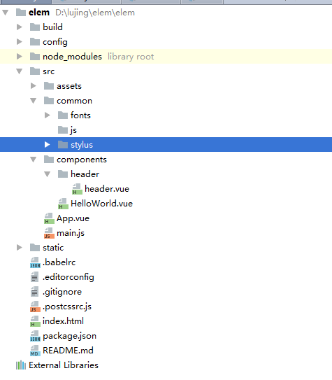

# Vue2.0

# 准备工作

1. 安装脚手架cli
 
	`npm i -g vue-cli`

	检查是否安装成功：vue -V

2. 初始化项目 init

	`vue init <template-name> <project-name>`

	<template-name>参数有6种：
	
	（1）webpack： A full-featured Webpack + vue-loader setup with hot reload, linting, testing & css extraction.
	
	（2）webpack-simple： A simple Webpack + vue-loader setup for quick prototyping.
	
	（3）browserify： A full-featured Browserify + vueify setup with hot-reload, linting & unit testing.
	
	（4）browserify-simple： A simple Browserify + vueify setup for quick prototyping.
	
	（5）pwa： PWA template for vue-cli based on the webpack template
	
	（6）simple： The simplest possible Vue setup in a single HTML file

3. 进入项目目录

	`cd <project-name>`

4. 安装相关的依赖

	`npm install`

5. 启动项目

	`npm run dev`
	

## 制作图标字体
	
在线网站：https://icomoon.io/app/#/select

1. 导入自己的svg图片

2. 选中所有导入的svg图片，点击generate font生成字体图标

3. 将fonts文件夹中的文件和style.css拿出来直接使用即可

## 项目目录结构的设置

1. 组件开发的一个原则是：就近维护

2. 创建common文件夹，包含公共资源，在创建子文件夹

	

3. 将字体图标的css文件style.css改名为icon.styl，同时，将css语法改成stylus的语法去掉大括号和分号

4. 删掉assets文件夹

## mock数据

1. 创建mock文件夹

2. 安装koa2
 
	`npm i koa koa-router`

3. 配置文件server.js：

		const Koa = require('koa');
		const app = new Koa();
		
		const Router = require('koa-router');// 路由插件
		const router = new Router();
		
		const appData = require('./data.json');
		const seller = appData.seller;
		const goods = appData.goods;
		const ratings= appData.ratings;
		
		
		router.get('/api/seller',function (ctx) {
		  ctx.body = seller
		});
		
		
		router.get('/api/goods',function (ctx) {
		  ctx.body = goods
		});
		
		router.get('/api/ratings',function (ctx) {
		  ctx.body = ratings
		});
		
		
		
		app.use(router.routes())
		  .use(router.allowedMethods());
		
		app.listen(3000);

4. 配置config/index.js

	    proxyTable: {
	      '/api':{
	        target:"http://localhost:3000",
	        secure:false
	      }
	    },

5. 配置package.json

		  "scripts": {
		    "dev": "webpack-dev-server --inline --progress --config build/webpack.dev.conf.js",
		    "start": "npm run dev",
		    "build": "node build/build.js",
		    "mock": "node --harmony ./mock/server.js"
		  },

6. 安装http-assert
 
	`cnpm i http-assert -D`

7. 启动mock数据

	`npm run mock`

---

准备工作到此结束